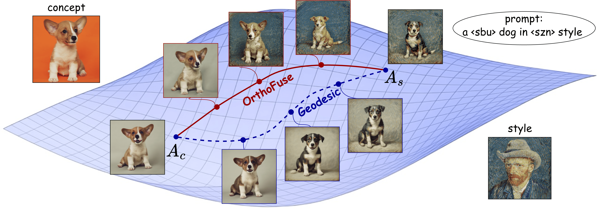

# OrthoFuse: Training-free Riemannian Fusion of Orthogonal Style-Concept Adapters for Diffusion Models

<a href="https://arxiv.org/abs/2502.06606"></a>
[](./LICENSE)


>In a rapidly growing field of model training there is a constant practical interest in parameter-efficient model fine-tuning and various techniques that use a small amount of training data to adapt the model to a narrow task. Despite the efficiency of LoRA, one of the most popular fine-tuning methods nowadays, there is an open question: how to combine several adapters tuned for different tasks in one which is able to yield adequate results on both tasks? Specifically, merging subject and style adapters for generative models remains unresolved. In this paper we seek to show that in the case of orthogonal fine-tuning (OFT), we can use structured orthogonal parametrization and, utilizing manifold theory, get the formulas for training-free adapter merging. In particular, we derive the structure of the manifold formed by the recently proposed Group and Shuffle $\mathcal{GS}$ orthogonal matrices, and obtain efficient formulas for the geodesics approximation between two points. We identify that naive geodesic merging compresses spectral distributions, reducing expressiveness; our Cayley transform correction restores spectral properties for higher-quality fusion. We conduct experiments in subject-driven generation tasks showing that our technique to merge two $\mathcal{GS}$ orthogonal matrices is capable to unite concept and style features of different adapters. To our knowledge, this is the first training-free method for merging multiplicative orthogonal adapters.
>



## Updates

- [XX/XX/XXX] ⏳⏳⏳ FLUX support (training-free merging + inference scripts/configs) will be released in ~2 weeks.
- [20/03/2026] 🔥🔥🔥 OrthoFuse first release (SDXL only).
- [21/02/2026] 🎉🎉🎉 OrthoFuse has been accepted to CVPR 2026.

## Prerequisites

This repository is tested on Linux with NVIDIA GPUs.

- **GPU**: 32GB+ VRAM recommended for SDXL inference (FLUX support is coming soon).
- **Python / PyTorch**: exact versions are pinned in `environment.yml` (recommended way to reproduce).
- **Core libs**: `diffusers` and `peft` versions are pinned in `environment.yml`.

## Setup

* Clone this repo:
```bash
git clone https://github.com/ControlGenAI/OrthoFuse
cd OrthoFuse
```

* Setup the environment. Conda environment `orthofuse_env` will be created and you can use it.
```bash
conda env create -f environment.yml
```

## Quickstart (merge & generate)

If you already have trained concept + style orthogonal adapters (or downloaded the pretrained ones linked below), you can merge them and generate images with:

```bash
./orthofuse_inference_merge_sdxl.sh <inference_type> <config_path> <t> <concept_layers_path> <style_layers_path> <num_images>
```

- **inference_type**: predefined inference preset. Two options:
  - `moft_merge`: default OrthoFuse merging
  - `moft_merge_fast`: faster implementation
- **config_path**: config with model settings.
- **t**: merge strength / interpolation parameter (see paper). Recommended: `t=0.6`.
- **concept_layers_path**: path to saved concept adapter layers.
- **style_layers_path**: path to saved style adapter layers.
- **num_images**: number of images to generate.

## Example (end-to-end)

This script runs a minimal demo by merging pretrained concept + style adapters and generating images.

Setup assumed by `orthofuse_merging_example.sh` (hardcoded demo):

- Concept: `dog6` (trained with placeholder token `'<dog6>'` and superclass `dog`)
- Style: `01_08` (trained with placeholder token `'<style>'` and superclass `style`)
- Merge type: `moft_merge_fast`
- Merge strength: `t=0.6`
- Adapter checkpoints (inputs): `pytorch_lora_weights_concept.safetensors` and `pytorch_lora_weights_style.safetensors` from the `dog6_style_01_08/checkpoint-800/` folder
- Config file (inputs): `output/concept_style/sdxl_article/example/logs/hparams.yml`

Outputs: images are saved under `config['output_dir']/samples/ns50_gs5.0/version_0/...` as defined by `hparams.yml`.

```bash
./orthofuse_merging_example.sh
```

## Orthogonal Adapter Training

### Concept adapters

```bash
./train.sh <trainer_type> <concept_name> <superclass> <placeholder_token> <nblocks> <moft_scale>
```

- **trainer_type**: training preset (e.g. `sdxl_concept`).
- **concept_name**: experiment name / output folder tag.
- **superclass**: class name (used for prompts / prior preservation, depending on config).
- **placeholder_token**: unique token representing the concept (e.g. `'<cat>'`).
- **nblocks**: number of OFT blocks / layers to adapt (paper uses `32` in examples).
- **moft_scale**: enable/disable multiplicative OFT scaling (boolean-like, e.g. `True`).

**Paths note:** `./train.sh` expects your concept dataset under `../dreambooth/dataset/<concept>` and writes outputs under `../OrthoFuse/output/concept_style/<trainer_type>`.

**Example (cat2 concept, SDXL, 32 OFT blocks)**:

```bash
./train.sh sdxl_concept cat2 cat '<cat>' 32 True
```


### Style adapters

```bash
./train_style.sh <trainer_type> <style_name> <superclass> <placeholder_token> <nblocks> <moft_scale>
```

Parameters are analogous to concept training:

- **trainer_type**: style training preset (e.g. `sdxl_style`).
- **style_name**: style identifier / output folder tag.
- **superclass**: class name for style (e.g. `style`).
- **placeholder_token**: token used to trigger the style (e.g. `'<style>'`).
- **nblocks**: number of OFT blocks / layers to adapt.
- **moft_scale**: enable/disable multiplicative OFT scaling.

**Paths note:** `./train_style.sh` expects style images under `../OrthoFuse/style/<style_name>` and writes outputs under `../OrthoFuse/output/concept_style/<trainer_type>`. 

**Example (style adapter for image_01_08.jpg)**:

```bash
./train_style.sh sdxl_style image_01_08.jpg style '<style>' 32 True
```

## Data and pretrained adapters

You can download training data and pretrained orthogonal adapters used in the paper here:

[Google Drive folder](https://drive.google.com/drive/folders/1ncJSpozSDvamOBAW7uw7PTTKzpIj1zUb?usp=sharing)

## Citation

If you utilize this code in your research, kindly cite our paper:
```
@article{aaa,
  title={OrthoFuse: Training-free Riemannian Fusion of Orthogonal Style-Concept Adapters for Diffusion Models},
  author={aaaa},
  journal={arXiv preprint arXiv:2502.06606},
  year={2026}
}
```